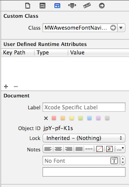
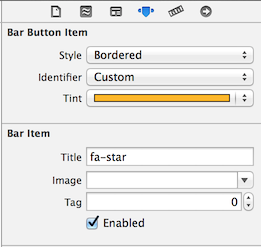
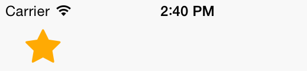

MWAwesomeFontWrappers
=====================

A collection of UIView subclasses to wrap around [FontAwesomeKit](https://github.com/PrideChung/FontAwesomeKit) to allow configuration of components from interface builder misusing the title attribute of the classes involved. This is a slightly hackish approach to configure icons in interface builder. It is a tradeoff caused by Apple not priorising custom font support in interface builder. Once Apple supports custom fonts, this project can be considered obsolete.

## Requirements

`MWButtonGroup` was written for ARC and requires iOS 7.0+ (but it should also work on earlier versions). It needs [FontAwesomeKit](https://github.com/PrideChung/FontAwesomeKit), which should be installed automatically, if using CocoaPods.

### Installation

`MWAwesomeFontWrappers` can be installed using CococaPods (see http://cocoapods.org).

Add the following line to your Podfile:

```ruby
pod 'MWAwesomeFontWrappers' , :git=> 'https://github.com/zliw/MWAwesomeFontWrappers.git'
```

Or wait until this package becomes an official package. 

## Usage

An example of the usage can be seen in the ```MWAwesomeFontWrapperExample```-Folder.

### Configuring elements in interface builder

Elements are created as normal. If you are using the provided class and use the name as given in the [official cheat sheet](http://fortawesome.github.io/Font-Awesome/cheatsheet/). Please note, that some icons are missing, as [FontAwesomeKit](https://github.com/PrideChung/FontAwesomeKit) currently only supports Version 4.0 of the font.

#### UIBarButtonItems

In interface builder set the custom class of `UIBarButtonItem` to `MWAwesomeFontNavigationBarItem`:



Then use the title attribute to specify the icon you want:



You won't see the icon in interface builder, but when running the application the button will automatically be created by the 'MWAwesomeFontNavigationBarItem` class. Tint color and connections made in interface builder are left intact:



#### UITabBarItems

In interface builder set the custom class of `UIBarButtonItem` to `MWAwesomeFontTabBarItem`. This is analogue to the step in UIBarButtonItem

Then use the title attribute to specify the icon you want. Here you have two options. If you just want the icon use the font awesome name eg. `fa-star`. If you want to give the item a title use this notation: `Star[fa-star]`. This way the title gets set to `Star` and the fa-star icon is used.


